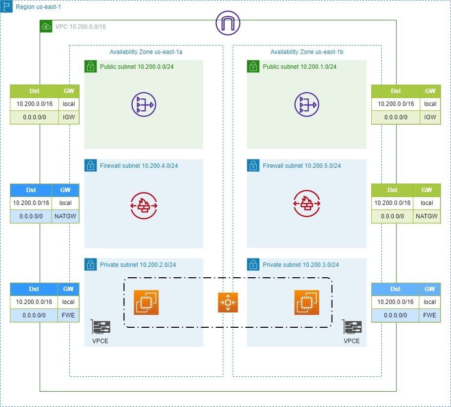

# Base Infrastructure for AWS

    The above code is meant to use in the us-east-1 region.
    EC2 instances and ASG not included in the code.
    NAT-GW are disabled by default, they can be enabled in tfvars file.

